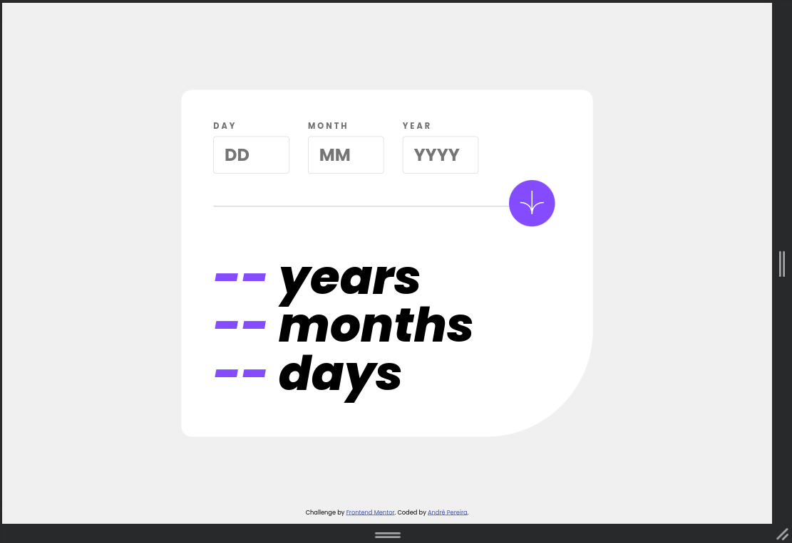
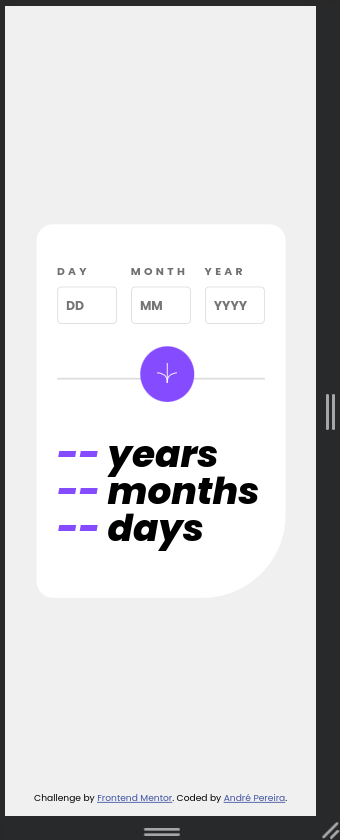

# Frontend Mentor - Age calculator app solution

This is a solution to
the [Age calculator app challenge on Frontend Mentor](https://www.frontendmentor.io/challenges/age-calculator-app-dF9DFFpj-Q).
Frontend Mentor challenges help you improve your coding skills by building realistic projects.

## Table of contents

- [Overview](#overview)
    - [The challenge](#the-challenge)
    - [Screenshots](#screenshots)
    - [Links](#links)
- [My process](#my-process)
    - [Built with](#built-with)
    - [Useful resources](#useful-resources)
- [Author](#author)

## Overview

### The challenge

Users should be able to:

- View an age in years, months, and days after submitting a valid date through the form
- Receive validation errors if:
    - Any field is empty when the form is submitted
    - The day number is not between 1-31
    - The month number is not between 1-12
    - The year is in the future
    - The date is invalid e.g. 31/04/1991 (there are 30 days in April)
- View the optimal layout for the interface depending on their device's screen size
- See hover and focus states for all interactive elements on the page
- **Bonus**: See the age numbers animate to their final number when the form is submitted

### Screenshots

#### Desktop

#### Mobile

### Links

- Solution URL: [Solution](https://www.frontendmentor.io/solutions/vanilla-solution-fBCz2rqFAm)
- Live Site URL: [Github Pages](https://dre1597.github.io/fm-age-calculator-app/)

## My process

### Built with

- Semantic HTML5 markup
- CSS custom properties
- Flexbox
- Mobile-first workflow

### Useful resources

- [Reset CSS](https://meyerweb.com/eric/tools/css/reset/)

## Author

- Frontend Mentor - [@dre1597](https://www.frontendmentor.io/profile/dre1597)
- LinkedIn - [@dre1597](https://www.linkedin.com/in/dre1597/)
